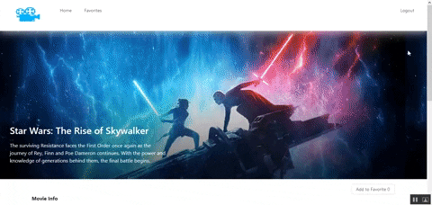
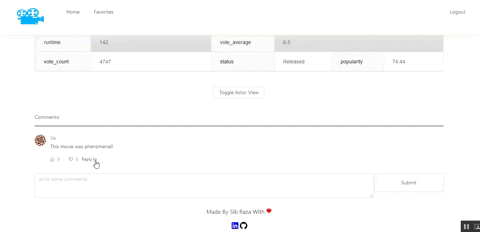
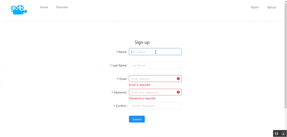
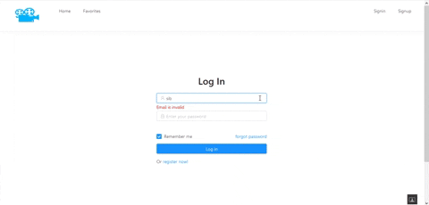

<h2>The Movie  App</h2>

This is a full stack MERN app that allows the user to do the following items listed below:

<ul>
<li>view the latest movies</li>
<li>view movie related information</li>
<li>view the cast for a specific movie</li>
<li>create a user account to comment, like or dislike comments, and create a favorite movie list </li>
</ul>

<h4>Used technologies</h4>
<ul>
  <li>Mongo DB</li>
  <li>Express.js</li>
  <li>React</li>
  <li>Node.js</li>
  <li>Ant Design</li>
  <li>React-Redux</li>
  <li>The Movie DB API </li>
</ul>

## Features

<h3>Landing Page</h3>

Users are placed on the landing page. By default, they can view the 20 latest trending movies. They can also click load more to view more movies.

<h4> Future enhancements: </h4>
<ul>
<li>Allow users to search for a specific movie</li>
<li>Allow users to filter movies by certain parameters</li>
</ul>

<h3>Movie Details Page</h3>

If a user clicks on a specific movie, they can view related information in a table. They can also view the cast of the movie

<h4> Future enhancements: </h4>
<ul>
<li>Change the user experience on how the cast loading feature works.</li>
</ul>

<h3>Comments Section</h3>

Users can leave comments on a movie. They can also reply to specific comments left by other users. Lastly, they can also like or dislike comments.

<h3>Register</h3>

 User can create their own account on this page.

<h4> Future enhancements: </h4>
<ul>
<li>Fix Formik/YUP to show validation errors during user input</li>
</ul>

<h3>Login</h3>

Users can login with their account on this page.

<h4> Future enhancements: </h4>
<ul>
<li>Implement remember me feature</li>
</ul>
